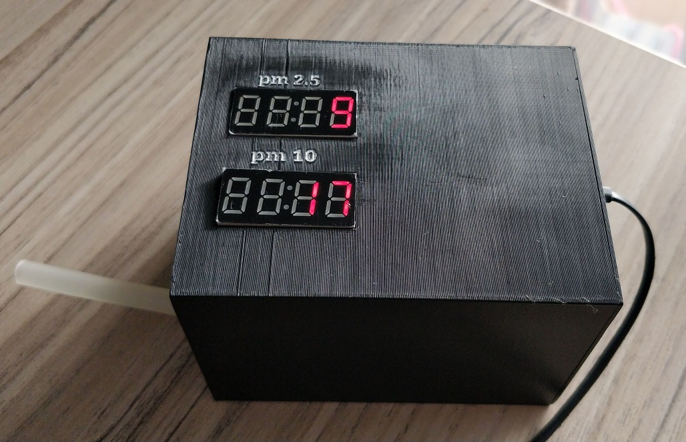

# From Hardware to API, From Arduino To Cloud

## This is a proof of concept that shows how can you read data from a sensor and write it to database trough API, and the show that data on Web.

### Disclaimer
Please note that data from this sensor is not too relevant, it can be used as a guide, but the numbers are not too precise.  

  
*
Solution diagram
*  

### Hardware
The sensor that I'm using is Nova PM sensor SDS011Arduino board is NodeMCU ESP82667 Segment display is TM1637 LED Display Module.  
This is the links of the components that I've been using (they are no referral links!)  
- [Nova PM sensor SDS011](https://www.aliexpress.com/item/32617788139.html?spm=a2g0s.9042311.0.0.27424c4dXRo748NodeMCU)  
- [ESP8266](https://www.aliexpress.com/item/32733851178.html?spm=a2g0s.9042311.0.0.27424c4dTgWALH)  
- [TM1637 LED Display Module](https://www.aliexpress.com/item/1961805015.html?spm=a2g0s.9042311.0.0.27424c4dMfBZmF)  
 

### Hardware Architecture
ESP8266 is the central unit, it reads data from SDS011 and sends it to TM1637 LED Display and API.  
If you go through the [`Arduino code`](Arduino/pollution-sensor-wifi-post-and-two-displays/pollution-sensor-wifi-post-and-two-displays.ino), you can clearly see how it works. Please note that you need to set your network name and password, to be able to connect the ESP8266 to your local network so it can send data to your API.  I've put some description comments in the code, it should be enough to do your setup.  

#### Connections
##### Dust sensor:

|ESP8266 | SDS011 |
|--------|--------|
| D2  | TX |
| D3  | RX |
| GND | GND|
| VIN | 5V |

##### PM 10 Display:

| ESP8266 | TM1637 LED |
|---------|------------|
| D5  | CLK |
| D6  | DIO |
| GND | GND |
| VIN | VCC |

##### PM 2.5 Display:

| ESP8266 | TM1637 LED |
|---------|------------|
| D7  | CLK |
| D8  | DIO |
| GND | GND |
| VIN | VCC |

  
*
Wiring diagram
*  

## Enclosing box
To have something compact, we need a box where we will put all these components. Because this is a custom build project, finding a box that will be compact for our components it's difficult, the easiest solution is to design and 3d print one. For this purpose, I designed and printed one.  
STL models:
- [`Box`](3DModel/PollutionSkeleton-Box.stl)  
- [`Cover`](3DModel/PollutionSkeleton-Cover.stl)  

### Designed model
  
*
3D Design 
*  
  
*
3D Design 
*  
  
*
3D Design 
*  

### 3D Printed model
[`Box`](3DModel/PollutionSkeleton-Box.stl)  
[`Cover`](3DModel/PollutionSkeleton-Cover.stl)  

  
*
3D Printed box
*  

## Software
Because we want data received from the sensor to be sent/written in the database, we need some sort of endpoint where our ESP8266 can send data. For that purpose, we will create a web site where we can store or view our data. Please note that in this example we use unprotected API, so do not expose your endpoint or use some kind of authentication to avoid abuse of your resources (if some destructive person finds your endpoint then it can easily overflow with data).  Our web solution has two parts, one is where ESP8266 has access and post data (sensor data about PM 10 and PM 2.5), and the other is a page we can see segmented data. Also, because we can deal with a lot of data, here I'm using an SQL View that will prepare the required data on data level and then EF will pick it up as prepared and display in our scree, also here I implemented a caching mechanism, to avoid the constant call to the DB when the data is not changed.[`EntriesApiController`](Web/PollutionSensor.v2/Controllers/EntriesApiController.cs) is the controller that has been called when ESP8266 tries to send data via the `API/Entries` endpoint, this is a POST method. Also in this controller, we have GET method that will retrieve all records from the DB, you can use this for debugging.  Also, we have [`StatisticsController`](Web/PollutionSensor.v2/Controllers/StatisticsController.cs), where we call the `EntriesService` to get statistics from DB.

### Prepare
#### Software
When you create a database, you need to get the ConnectionString and put it in [`appsettings.json`](Web/PollutionSensor.v2/appsettings.json) instead of the value `YOUR_DATABASE_CONNECTION_HERE`.  
Also, when you create the database, you need to copy/paste this scripts:  
- [`dbo.sp_GetDailyAverage.sql`](Web/PollutionSensor.v2/SQL/StoredProcedure/dbo.sp_GetDailyAverage.sql)
- [`dbo.sp_GetHourlyAverage.sql`](Web/PollutionSensor.v2/SQL/StoredProcedure/dbo.sp_GetHourlyAverage.sql)  

This will be enough to run the web application or host it if you like, you can also test your endpoints with Postman or something similar just to be sure that the software part of this project works fine.  
#### Hardware/Arduino
When you're done with the web project, now is time to put the values inside the [`Arduino code`](Arduino/pollution-sensor-wifi-post-and-two-displays/pollution-sensor-wifi-post-and-two-displays.ino).  
Here `NAME_OF_YOUR_NETWORK` should be the name of your local network, and also `NETWORK_PASSWORD` should be the password of your network.  
For the endpoint, here, the value of `PATH_OF_YOUR_ENDPOINT` should be replaced with the address of your endpoint, for example, http://mysensordatadomai.com/api/Entries if you host your application on some web/cloud provider, or http://localhost:27005/api/Entries if the application is hosted on your machine (please check the port).

### Deploy
When you're done with these changes, you can use [`Arduino App`](https://www.arduino.cc/en/software) to deploy the code to your ESP8266. Here is a tutorial if you're unfamiliar with ESP8266, how to upload code to it:  [How to Program NodeMCU on Arduino IDE](https://www.instructables.com/How-to-Program-NodeMCU-on-Arduino-IDE/).  
You will need the driver:  
- [CP210x USB to UART Bridge VCP Drivers](https://www.silabs.com/products/development-tools/software/usb-to-uart-bridge-vcp-drivers)
- Then, you need to install the ESP8266 add-on for the Arduino IDE. For that, go to File > Preferences.
- Enter http://arduino.esp8266.com/stable/package_esp8266com_index.json into the “Additional Board Manager URLs” field as shown in the figure below. Then, click the “OK” button.

 
*
Install board
*  

Because there are many options, here is my configuration, so you may find it useful:
 
*
My selected configuration
*  

You must select the right COM port, you can check that on DeviceManager, once you install the driver and connect the ESP8266 with a USB cable.  
  
*
My com port
*  